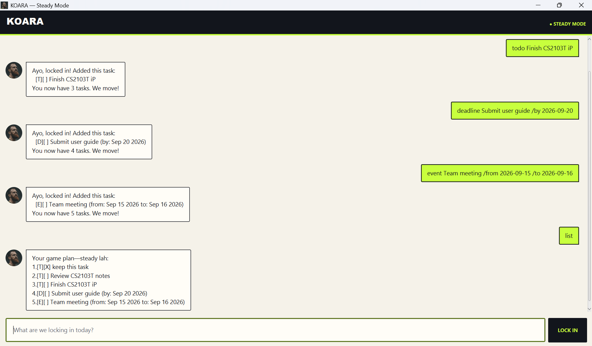

# Koara

Koara is a modern desktop chatbot for managing personal tasks and training-client records. It combines fast command-based interaction with automatic local storage, clear error feedback, and a focused JavaFX interface.

## Features

- Create to-dos, deadlines, and events using validated ISO dates.
- List, search, mark, unmark, and delete tasks.
- Add, list, search, edit, and delete client records.
- Save tasks and clients automatically and recover gracefully from missing or invalid data files.
- Highlight invalid commands without ending the session or corrupting in-memory data.

See the **[Koara User Guide](https://itzkhoadao.github.io/ip/)** for every command, example, and data-file detail.

## Run from source

Koara requires **Java 25**.

1. Clone this repository and open a terminal in the project root.
2. Build the cross-platform application JAR:
   - Windows: `gradlew.bat clean shadowJar`
   - macOS/Linux: `./gradlew clean shadowJar`
3. Start Koara with `java -jar build/libs/koara.jar`.

In IntelliJ IDEA, configure the project SDK and language level as Java 25, then run `koara.gui.Launcher`.

## Development checks

Run the complete automated test and code-quality suite before committing:

- Windows: `gradlew.bat check`
- macOS/Linux: `./gradlew check`

The GitHub Actions workflow runs the same checks with Java 25 on Windows, macOS, and Ubuntu.
